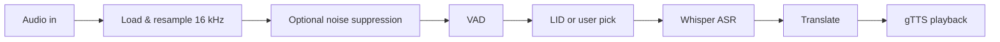

# S2ST — Speech-to-Speech Translation

**Speak in one language. Hear the answer in another.**  
This project runs a full **speech → text → translate → speech** pipeline locally: your microphone (or an uploaded clip) is cleaned, checked for voice, identified by language, transcribed with OpenAI Whisper, translated with Google Translate, and read back with text-to-speech.

---

## Why this exists

| Goal | How it’s handled |
|------|-------------------|
| Real conversations across languages | End-to-end: voice in, translated audio out |
| Works in the browser | Flask serves a single-page UI (`s2st_app.html`) |
| Works without a browser | `main.py` records from the desktop mic and plays TTS |
| Messy rooms & quiet speakers | Noise suppression (mic path), normalization, VAD |

---

## Pipeline at a glance



1. **Ingest** — WAV directly, or WebM/OGG via **pydub** + **ffmpeg**.  
2. **Preprocess** — Mono, **16 kHz**, peak normalization. Mic recordings get **noise suppression**; uploads skip it to avoid hurting clean files.  
3. **VAD** — Rejects silence / no-speech.  
4. **Language** — Auto **language identification** or a **user-selected** source language.  
5. **ASR** — **Whisper** (`medium` in `model.py`) with script-oriented prompts for several languages.  
6. **Translation** — **deep-translator** (Google Translate); source is passed as `auto` on transcribed text for robust script handling.  
7. **TTS** — **gTTS**; original and translated audio are returned as **base64** MP3 in the web API.

---

## Live speech translation: end-to-end flow

This is what happens when you use the **web UI** so you can reason about timing, permissions, and outputs.

### Record tab (microphone)

1. **Languages** — Set **source** (or **Auto-detect**) and **target**. You can use **⇄** to swap. Auto-detect runs **after** capture using the audio itself; a fixed source skips detection and forces Whisper to that language.
2. **Permission** — Click the mic. The browser asks for **microphone** access; you must allow it for this site.
3. **Capture** — Recording uses the **Web Audio API** at **16 kHz** mono. Audio is accumulated into a **WAV** blob in the page (no streaming ASR — the full clip is sent when you stop).
4. **Stop** — Click the mic again to stop **early**, or wait until the **max duration** slider (3–15 seconds) ends; the clip is packaged and sent to the server.
5. **Server processing** — The backend loads the WAV, makes it mono, **resamples to 16 kHz** if needed, **normalizes** level, applies **noise suppression** (mic path only), runs **VAD**, then **LID** (if source is Auto), **Whisper** transcription, **translation**, and **gTTS** for both original wording and translation.
6. **Results** — You get **original text**, **translated text**, a **language-confidence** bar (meaningful when source was Auto), and two **MP3** players (**original** and **translated** speech). The UI tries to **auto-play** original audio, then translated (browsers may block autoplay; use the play buttons if needed).
7. **Extras** — **Copy** text, **Save .txt**, **Share** (native share or clipboard), **History** (last items with replay), and **Record again** to clear the result panel.

### What “live” means here

The app is **not** a real-time streaming interpreter: each request is **one recorded segment** processed as a batch. Latency comes from upload + Whisper + translate + TTS. For short clips this still feels interactive; very long files are better handled via **Upload** (same pipeline, different input).

---

## Uploading audio (file instead of mic)

Use the **Upload** tab when you already have a file (podcast clip, exported voice memo, screen recording audio, etc.).

### How to upload

1. Switch to **Upload** (next to **Record**).
2. **Click** the dashed area to pick a file, or **drag and drop** a file onto it.
3. The UI shows the **file name and size**. Click **Translate this file** to run the pipeline. The file input clears after submit so you can upload another file.

### Formats

- **Preferred:** **WAV** (read directly; fastest path).
- **Also supported:** Typical browser/OS audio types such as **MP3, OGG, M4A, WEBM** — these are converted with **pydub** + **ffmpeg** to mono **16 kHz** WAV internally.

If conversion fails, install **ffmpeg**, confirm the file is not corrupt, and try exporting to **WAV** from an editor.

### How upload differs from microphone

| Aspect | Microphone (`Record`) | File (`Upload`) |
|--------|------------------------|-----------------|
| `is_upload` sent to API | `false` | `true` |
| **Noise suppression** | Applied | **Skipped** (assumes file is already usable; suppression can hurt clean studio audio) |
| Everything else | Same: normalize → VAD → LID or fixed source → Whisper → translate → gTTS | Same |

So uploads still go through **VAD** (silence / no speech is rejected), **Whisper**, and the rest — only the optional denoise step is omitted.

### API note for uploads

`POST /translate` accepts multipart form fields: `audio` (file), `src_lang`, `target_lang`, and `is_upload` (`"true"` / `"false"`). Integrators sending pre-recorded audio should set **`is_upload=true`** when the audio was not captured from a noisy live mic.

---

## Requirements

- **Python** 3.9+ (3.10+ recommended)  
- **ffmpeg** — required for non-WAV conversion (browser recordings often use WebM)

| OS | Install |
|----|--------|
| Ubuntu / Debian | `sudo apt install ffmpeg` |
| macOS | `brew install ffmpeg` |
| Windows | [ffmpeg.org/download.html](https://ffmpeg.org/download.html) — add `ffmpeg` to your `PATH` |

---

## Quick start

```bash
# From the project root
python -m venv .venv
# Windows: .venv\Scripts\activate
# Unix:    source .venv/bin/activate

pip install -r requirements.txt
python app.py
```

Open **http://localhost:5000** in Chrome or Firefox (microphone permission required).

**First launch:** Whisper downloads the model you configure (default **`medium`**, **~1.5 GB**). Weights are cached under your user cache; later starts are faster. For smaller disk/RAM, set **`WHISPER_MODEL=base`** (~140 MB) or **`small`**.

---

## Using the app

### Web UI

1. Choose **source** language or **Auto-detect**, and a **target** language.  
2. **Record** — see [Live speech translation: end-to-end flow](#live-speech-translation-end-to-end-flow). **Upload** — see [Uploading audio](#uploading-audio-file-instead-of-mic).  
3. Wait for transcription, translation, and playback (or use the audio controls if autoplay is blocked).  
4. Use **Play original** / **Play translated**, **Save** (`.txt`), **Share**, or **History** as needed.

### CLI (no browser)

For quick local tests from the default microphone:

```bash
python main.py
```

Follow the prompts; the CLI uses `recorder.py`, `tts.py`, and the same core modules as the server.

---

## API (for integrators)

| Method | Path | Purpose |
|--------|------|---------|
| `GET` | `/` | Serves the web UI |
| `POST` | `/translate` | Multipart form: `audio` (file), optional `src_lang`, `target_lang`, `is_upload` |

**Form fields**

| Field | Meaning |
|-------|---------|
| `audio` | Raw file bytes (WAV or anything **ffmpeg**/`pydub` can decode). |
| `src_lang` | Whisper/source language code, or `auto` (default) for LID on the server. |
| `target_lang` | Desired translation language (default `en`). |
| `is_upload` | String `true` or `false`: if `true`, **noise suppression is not** applied (see [upload vs mic](#how-upload-differs-from-microphone)). |

**JSON response (success)**

`original_text`, `translated_text`, `src_lang`, `tgt_lang`, `confidence` (1.0 when the user fixed the source language; otherwise from LID), `original_audio_b64`, `audio_b64` (MP3, base64).

---

## Troubleshooting

| Symptom | What to check |
|---------|----------------|
| **500** errors | Terminal traceback from `app.py`; confirm **ffmpeg** and all **pip** packages. |
| **No voice detected** | Louder/closer mic; default input device; less background noise. |
| **Browser blocks mic** | Allow microphone for this site; reset permission via the address bar lock icon. |
| **Upload fails or 500 on non-WAV** | Ensure **ffmpeg** is installed and on `PATH`; try a **WAV** export. |
| **Slow first run** | Expected while **Whisper medium** downloads and loads. |

---

## Project layout

| File | Role |
|------|------|
| `app.py` | Flask app, `/translate` |
| `s2st_app.html` | Front-end UI |
| `model.py` | Whisper model load (see `WHISPER_MODEL`) |
| `asr.py` | Speech recognition |
| `lid.py` | Language identification |
| `vad.py` | Voice activity detection |
| `noise_suppression.py` | Speech-band cleaning |
| `translator.py` | Translation |
| `recorder.py` / `tts.py` | Desktop mic + playback |
| `main.py` | CLI entry point |

---

## Production (e.g. Render)

Hosted tiers often use **short HTTP timeouts** and **limited RAM**. The default **`medium`** model is large (~1.4 GB download, heavy RAM). If the first request tries to **download** the full checkpoint inside Gunicorn, the worker can hit **WORKER TIMEOUT** or **OOM** before finishing.

**Recommended on Render (or similar):**

1. Set environment variable **`WHISPER_MODEL=base`** (or `small`) unless you use a plan with enough RAM for `medium`.
2. **Cache weights at build time** so the running dyno does not download on first `/translate`:

   ```bash
   pip install -r requirements.txt && python download_whisper.py
   ```

   Use the **same** `WHISPER_MODEL` in the build environment as in runtime.

3. Start with **gunicorn** using the included config (long timeout, single worker by default):

   ```bash
   gunicorn -c gunicorn.conf.py app:app
   ```

   A **`Procfile`** is included for platforms that read it. Tune **`GUNICORN_TIMEOUT`** (default **300** seconds) if needed.

4. Optional: **`PRELOAD_WHISPER=true`** loads Whisper when the worker imports the app (faster first request; slightly slower deploy boot).

Local development: `python app.py` is enough; you do not need gunicorn.

---

## Credits

Built with **OpenAI Whisper**, **Flask**, **gTTS**, **deep-translator**, and common scientific stack (**NumPy**, **SciPy**, **soundfile**, **pydub**, **sounddevice**).
