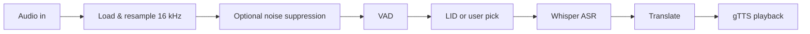

# S2ST — Speech-to-Speech Translation

**Speak in one language. Hear the answer in another.**  
This project runs a full **speech → text → translate → speech** pipeline locally: your microphone (or an uploaded clip) is cleaned, checked for voice, identified by language, transcribed with OpenAI Whisper, translated with Google Translate, and read back with text-to-speech.

---

## Why this exists

| Goal | How it’s handled |
|------|-------------------|
| Real conversations across languages | End-to-end: voice in, translated audio out |
| Works in the browser | Flask serves a single-page UI (`s2st_app.html`) |
| Works without a browser | `main.py` records from the desktop mic and plays TTS |
| Messy rooms & quiet speakers | Noise suppression (mic path), normalization, VAD |

---

## Pipeline at a glance



1. **Ingest** — WAV directly, or WebM/OGG via **pydub** + **ffmpeg**.  
2. **Preprocess** — Mono, **16 kHz**, peak normalization. Mic recordings get **noise suppression**; uploads skip it to avoid hurting clean files.  
3. **VAD** — Rejects silence / no-speech.  
4. **Language** — Auto **language identification** or a **user-selected** source language.  
5. **ASR** — **Whisper** (`medium` in `model.py`) with script-oriented prompts for several languages.  
6. **Translation** — **deep-translator** (Google Translate); source is passed as `auto` on transcribed text for robust script handling.  
7. **TTS** — **gTTS**; original and translated audio are returned as **base64** MP3 in the web API.

---

## Requirements

- **Python** 3.9+ (3.10+ recommended)  
- **ffmpeg** — required for non-WAV conversion (browser recordings often use WebM)

| OS | Install |
|----|--------|
| Ubuntu / Debian | `sudo apt install ffmpeg` |
| macOS | `brew install ffmpeg` |
| Windows | [ffmpeg.org/download.html](https://ffmpeg.org/download.html) — add `ffmpeg` to your `PATH` |

---

## Quick start

```bash
# From the project root
python -m venv .venv
# Windows: .venv\Scripts\activate
# Unix:    source .venv/bin/activate

pip install -r requirements.txt
python app.py
```

Open **http://localhost:5000** in Chrome or Firefox (microphone permission required).

**First launch:** Whisper downloads the **`medium`** model (on the order of **~1.5 GB**). It is cached; later starts are faster.

---

## Using the app

### Web UI

1. Choose **source** language or **Auto-detect**, and a **target** language.  
2. Use the **mic** to record, or **upload** a file.  
3. Wait for transcription, translation, and optional playback.  
4. Use **Play**, **Save** (`.txt`), or **Share** (clipboard) as needed.

### CLI (no browser)

For quick local tests from the default microphone:

```bash
python main.py
```

Follow the prompts; the CLI uses `recorder.py`, `tts.py`, and the same core modules as the server.

---

## API (for integrators)

| Method | Path | Purpose |
|--------|------|---------|
| `GET` | `/` | Serves the web UI |
| `POST` | `/translate` | Multipart form: `audio` (file), optional `src_lang`, `target_lang`, `is_upload` |

Successful JSON includes `original_text`, `translated_text`, `src_lang`, `tgt_lang`, `confidence`, `original_audio_b64`, `audio_b64` (MP3, base64).

---

## Troubleshooting

| Symptom | What to check |
|---------|----------------|
| **500** errors | Terminal traceback from `app.py`; confirm **ffmpeg** and all **pip** packages. |
| **No voice detected** | Louder/closer mic; default input device; less background noise. |
| **Browser blocks mic** | Allow microphone for this site; reset permission via the address bar lock icon. |
| **Slow first run** | Expected while **Whisper medium** downloads and loads. |

---

## Project layout

| File | Role |
|------|------|
| `app.py` | Flask app, `/translate` |
| `s2st_app.html` | Front-end UI |
| `model.py` | Whisper model load (`medium`) |
| `asr.py` | Speech recognition |
| `lid.py` | Language identification |
| `vad.py` | Voice activity detection |
| `noise_suppression.py` | Speech-band cleaning |
| `translator.py` | Translation |
| `recorder.py` / `tts.py` | Desktop mic + playback |
| `main.py` | CLI entry point |

---

## Production note

`requirements.txt` includes **gunicorn** for deploying behind a process manager; bind and workers depend on your host. For local development, `python app.py` is enough.

---

## Credits

Built with **OpenAI Whisper**, **Flask**, **gTTS**, **deep-translator**, and common scientific stack (**NumPy**, **SciPy**, **soundfile**, **pydub**, **sounddevice**).
